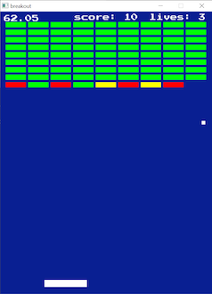

# breakout

Just a quick-and-dirty game project to shake off some of the rust and
get back into hobbyist game development.

## Building

Pre-requisites:

* C compiler
* meson
* sdl2
* sdl2-ttf

1. Clone or otherwise download the source code held in this repository.
2. `cd breakout`
3. `meson setup builddir`
4. `ninja -C builddir`
5. `./builddir/breakout`

## Controls

The left arrow key moves the paddle to the left and the right arrow key
moves the paddle to the right.
